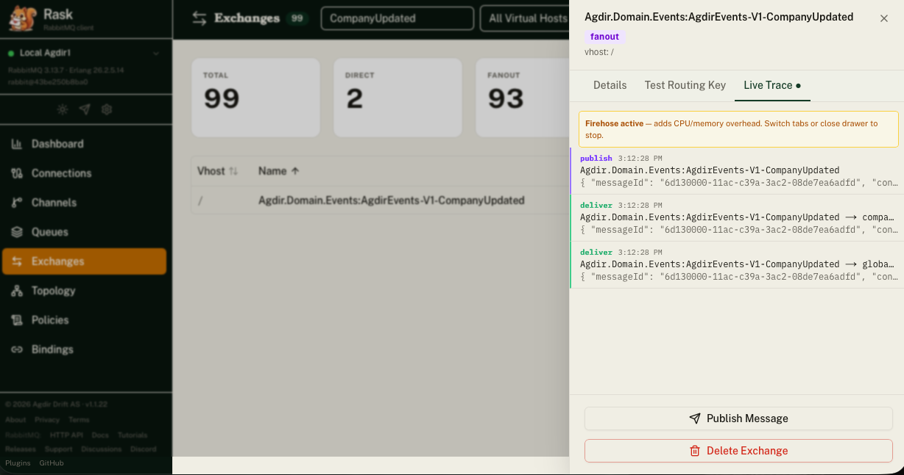
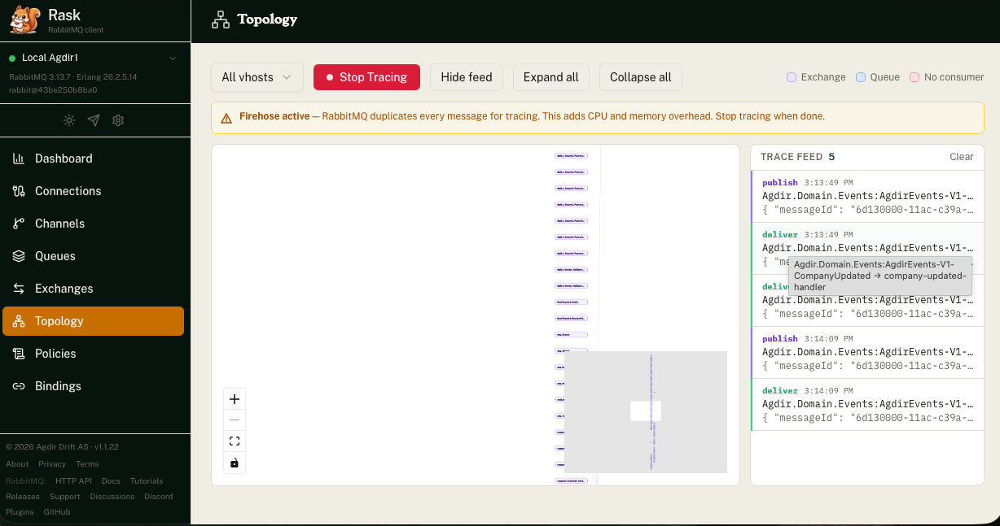
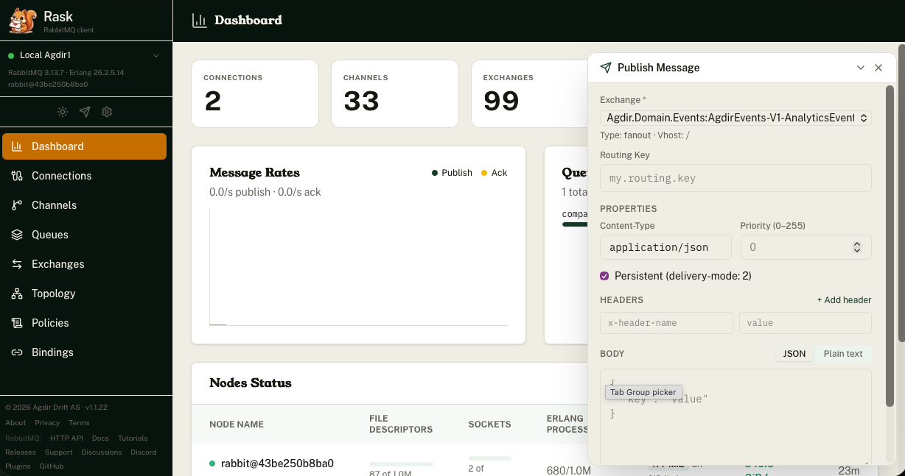
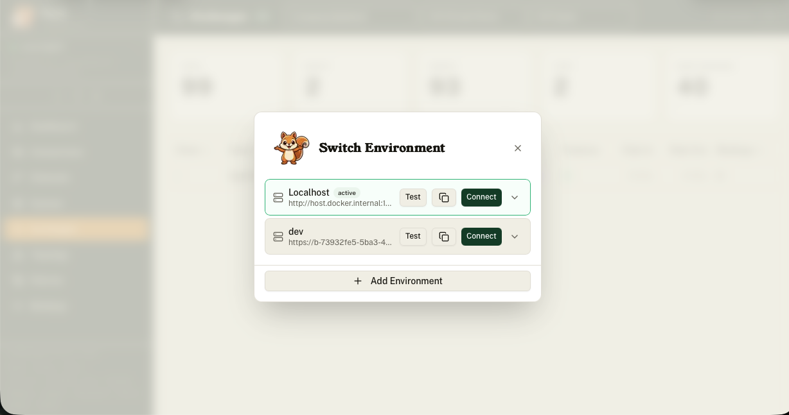

# Rask

[](https://github.com/agdiras/rask.agdir.farm/actions/workflows/ci.yml)
[](LICENSE)
[](package.json)
[](https://github.com/agdiras/rask.agdir.farm)
[](https://github.com/agdiras/rask.agdir.farm/commits/main)
[](https://github.com/agdiras/rask.agdir.farm/issues)

> Named after Ratatoskr, the Norse messenger squirrel.

A modern web UI for RabbitMQ management. All broker calls are proxied server-side — no direct browser-to-RabbitMQ exposure.

Maintained by [Agdir Drift AS](https://agdir.no).

<a href="public/screenshots/rask-queue.png"></a>
<a href="public/screenshots/rask-topology.png"></a>
<a href="public/screenshots/rask-publish-on-dashbaord.png"></a>
<a href="public/screenshots/rask-env.png"></a>

---

## Quick Start (Docker)

The easiest way to run Rask — no Node.js required. Configure your RabbitMQ connection via the UI after starting.

### Option 1 — RabbitMQ in another container (shared network)

```bash
docker network create rask-net

# attach your existing RabbitMQ container to the network, or start a new one:
docker run -d --name rabbitmq --network rask-net rabbitmq:4-management

docker run -d \
  --name rask \
  --network rask-net \
  -p 35672:35672 \
  -v rask-data:/app/data \
  ghcr.io/agdiras/rask.agdir.farm:latest
```

In the UI use `http://rabbitmq:15672` as the management URL.

### Option 2 — RabbitMQ on the host machine

```bash
docker run -d \
  --name rask \
  --add-host host.docker.internal:host-gateway \
  -p 35672:35672 \
  -v rask-data:/app/data \
  ghcr.io/agdiras/rask.agdir.farm:latest
```

In the UI use `http://host.docker.internal:15672` as the management URL. (`--add-host` is only needed on Linux; Docker Desktop on Mac/Windows includes it automatically.)

### Option 3 — Docker Compose (Rask + RabbitMQ together)

```yaml
services:
  rask:
    image: ghcr.io/agdiras/rask.agdir.farm:latest
    ports:
      - "35672:35672"
    volumes:
      - rask-data:/app/data
    depends_on:
      rabbitmq:
        condition: service_healthy

  rabbitmq:
    image: rabbitmq:4-management
    ports:
      - "5672:5672"
      - "15672:15672"
    healthcheck:
      test: ["CMD", "rabbitmq-diagnostics", "-q", "ping"]
      interval: 10s
      timeout: 5s
      retries: 10
      start_period: 30s

volumes:
  rask-data:
```

Save as `compose.yml` and run:

```bash
docker compose up -d
```

In the UI use `http://rabbitmq:15672` as the management URL.

---

## Setup (from source)

### 1. Install dependencies

```bash
pnpm install
```

### 2. Configure connection

### 3. Run the dev server

```bash
pnpm dev
```

Open [http://localhost:35672](http://localhost:35672).

---

## Environment Variables

Connection settings are managed through the UI (stored in SQLite). On first run a **Localhost** environment is created automatically.

For advanced use, copy `.env.example` to `.env` and adjust:

```bash
cp .env.example .env
```

| Variable | Default | Description |
|----------|---------|-------------|
| `STORAGE_ENCRYPTION_KEY` | _(unset)_ | Encrypt the SQLite DB at rest (any string) |

---

## Architecture

**Server-first, client islands.** Pages default to Server Components. TanStack Query lives only in `"use client"` components that need polling or mutations. Layout and navigation are static server components. `amqplib` is server-only.

```
Browser (React)
  → Next.js API Routes (/api/*)
    → RabbitMQ Management HTTP API (port 15672)
    → RabbitMQ AMQP (port 5672)  ← server-only
```

---

## Project Structure

```
app/
  layout.tsx              Root layout (fonts, providers)
  (app)/
    layout.tsx            App shell (sidebar + header)
    page.tsx              Overview
    queues/page.tsx       Queue list with live polling
    settings/page.tsx     Connection settings
  api/
    settings/route.ts     Read/write connection settings
    rabbitmq/
      queues/route.ts     Proxy → RabbitMQ /api/queues
      overview/route.ts   Proxy → RabbitMQ /api/overview

components/
  layout/
    sidebar.tsx           Navigation sidebar
    header.tsx            Connection status + theme toggle
  providers.tsx           QueryClientProvider + ThemeProvider
  ui/                     shadcn components

lib/
  types.ts                RabbitMQ entity types
  rabbitmq.ts             Management API client
  env.ts                  SQLite env storage + encryption
  utils.ts                cn() utility

docs/
  TODO.md                 Upcoming features
  PRICING.md              Pricing tiers
```

---

## Development

```bash
pnpm dev      # Start dev server
pnpm build    # Production build
pnpm lint     # Lint
```

---

## License & Pricing

Licensed under [BSL 1.1](LICENSE) — free for individuals and teams under 10 users. See [docs/PRICING.md](docs/PRICING.md) for tiers.

Limits are **not technically enforced** — no license keys, no phone-home, no feature gates. If Rask is useful to your organization, please use the right plan.
